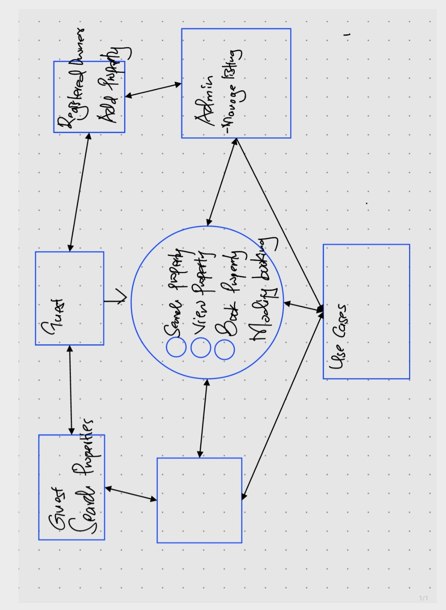

# requirement-analysis

### Requirement Analysis

# Requirement Analysis in Software Development

This repository explores the critical process of requirement analysis in software development, emphasizing its importance as the foundation of successful projects. It provides insights into identifying and understanding stakeholders' needs, translating them into actionable development tasks, and avoiding common pitfalls. Topics covered include an overview of requirement analysis, techniques and tools like use cases and wireframes, common challenges faced during the process, and real-world case studies. Additionally, the repository offers resources such as templates and further reading materials to support developers and teams in mastering this essential phase of software development.

# Requirement Analysis in Software Development

## Why is Requirement Analysis Important?

Requirement analysis is a critical phase in the Software Development Lifecycle (SDLC) that ensures clarity, alignment, and efficiency in software development. It plays a pivotal role by:

- **Clarity and Understanding**: Ensuring stakeholders have a clear and mutual understanding of what the system should do and how it should perform, reducing ambiguity and miscommunication.
- **Scope Definition**: Clearly defining the project scope, preventing scope creep and ensuring that the development remains focused and aligned with stakeholder expectations.
- **Basis for Design and Development**: Providing a strong foundation for the system's design and development phases by detailing both functional and non-functional requirements.
- **Cost and Time Estimation**: Enabling accurate estimation of resources, time, and budget required to complete the project.
- **Quality Assurance**: Establishing benchmarks to ensure the final product meets the defined requirements, leading to higher customer satisfaction and fewer post-release issues.

## Key Activities in Requirement Analysis

Requirement analysis involves several essential activities to ensure the software meets the stakeholders' expectations:

- **Requirement Gathering** 🗂️  
  Engaging with stakeholders to collect initial requirements through interviews, surveys, workshops, observation, and document analysis.

- **Requirement Elicitation** ✍️  
  Refining and elaborating on gathered requirements using brainstorming sessions, focus groups, and prototyping to align on detailed needs.

- **Requirement Documentation** 📚  
  Documenting the requirements in structured formats, such as requirement specification documents, user stories, and use case diagrams, ensuring clarity and traceability.

- **Requirement Analysis and Modeling** 📊  
  Analyzing and prioritizing requirements based on importance and feasibility. This step includes creating models like data flow diagrams or entity-relationship diagrams to visualize requirements.

- **Requirement Validation** ✅  
  Reviewing documented requirements with stakeholders to ensure they are accurate and complete. Acceptance criteria and traceability matrices are also established during this phase to maintain alignment throughout development.

## Types of Requirements

### Functional Requirements ⚙️  
Functional requirements define what the system should do. For a booking management project, examples include:

- **Search Properties**: Users should be able to search for properties based on criteria such as location, price, and availability.  
- **User Registration**: Allow new users to create accounts with personal details and secure login credentials.  
- **Property Listings**: Display properties with essential details, including images, price, and availability.  
- **Booking System**: Enable users to book properties, view booking details, and manage their bookings.  
- **User Authentication**: Implement a secure login and registration process for users.  

### Non-functional Requirements 🛡️  
Non-functional requirements describe how the system should perform. Examples for the booking management project include:

- **Performance**: Ensure pages load within 2 seconds and the system can handle up to 1,000 concurrent users.  
- **Security**: Implement data encryption, secure login processes, and safeguards against vulnerabilities.  
- **Scalability**: Allow the system to scale horizontally to accommodate increased traffic.  
- **Usability**: Design an intuitive user interface to make navigation and task execution seamless.  
- **Reliability**: Achieve 99.9% uptime and implement robust recovery mechanisms for quick fault resolution.  

## Acceptance Criteria

Acceptance criteria define the conditions under which a feature is considered complete and accepted by stakeholders. These criteria ensure a shared understanding of the feature’s purpose and expected behavior. 

### Importance of Acceptance Criteria

- **Clarity**: Provides stakeholders and developers with a clear understanding of feature requirements, reducing ambiguity.  
- **Testing and Validation**: Serves as a baseline for testing the feature to confirm it meets the expected standards.  
- **Quality Assurance**: Helps maintain high-quality deliverables by ensuring all functionalities meet predefined benchmarks.

### Example: Checkout Feature for Booking Management System  
**Acceptance Criteria**:  
- Users should be able to select available dates for a property.  
- Users must confirm their booking and view a summary before finalizing.  
- A confirmation email should be sent to the user within 2 minutes of completing the booking.

By defining specific, measurable, and stakeholder-approved acceptance criteria, projects are more likely to deliver quality outcomes that align with expectations.

### Use Case Diagrams

### Benefits of Use Case Diagrams
- **Clear Visualization**: Provide an easy-to-understand view of system functionalities and user interactions.
- **Stakeholder Communication**: Bridge understanding between stakeholders and the development team.
- **Requirement Organization**: Help organize system requirements effectively.
- **Gap Analysis**: Reveal missing or unclear requirements early in the project lifecycle.

### Example Use Case for a Booking System
- **Actors**:
  - Guest: Can search properties and view property details.
  - Registered User: Can search, view, book properties, and manage bookings.
  - Admin: Can manage property listings and bookings.

